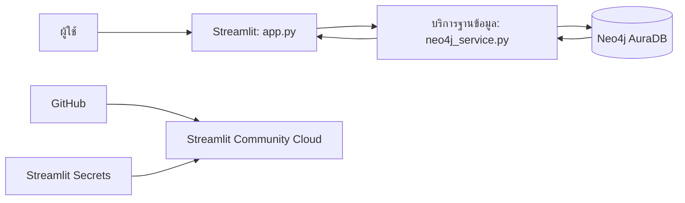
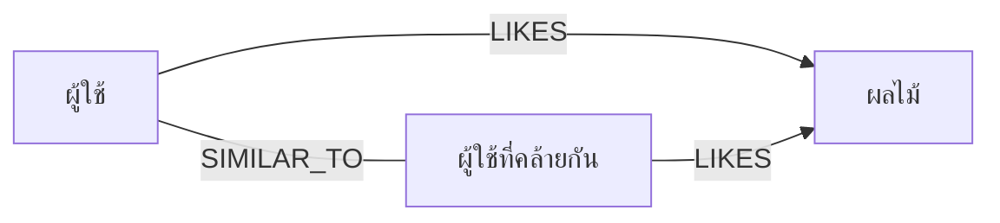

# คู่มือสร้างระบบแนะนำผลไม้ด้วย Neo4j Aura และ Streamlit

คู่มือนี้พาสร้างระบบแนะนำผลไม้จากความชอบของผู้ใช้ โดยเก็บข้อมูลเป็นกราฟใน Neo4j Aura เขียนคำแนะนำด้วย Cypher และแสดงผลผ่าน Streamlit

> ในหน้าจอและโจทย์นี้ใช้คำว่า “ผลไม้” แต่โค้ดและฐานข้อมูลปัจจุบันยังใช้ label `Water`, property `water_id` และฟังก์ชันบางส่วนที่มีคำว่า `water` ตามชื่อเดิมของโครงงาน หากเปลี่ยนชื่อเหล่านี้ ต้องแก้ทั้ง schema, query, Python และข้อมูลในฐานข้อมูลให้สอดคล้องกัน

## 1. สิ่งที่จะได้เรียนรู้

- ออกแบบ Property Graph ด้วย Node, Label, Property และ Relationship
- สร้างข้อกำหนด unique และข้อมูลตัวอย่างด้วย Cypher
- เดินกราฟเพื่อค้นหาผลไม้ที่ผู้ใช้ซึ่งมีความชอบคล้ายกันเลือก
- สร้างคำแนะนำที่อธิบายเหตุผลได้
- เชื่อม Python กับ Neo4j Aura ด้วย Neo4j Python Driver
- สร้างหน้าแอปด้วย Streamlit และจัดการ credential ด้วย Secrets
- เผยแพร่แอปผ่าน GitHub และ Streamlit Community Cloud

## 2. ภาพรวมระบบ



- `app.py` แสดงหน้าแรก เมนู และหน้าจัดการข้อมูล
- `neo4j_service.py` เชื่อมต่อฐานข้อมูลและเรียก Cypher
- Neo4j AuraDB จัดเก็บผู้ใช้ ผลไม้ และความสัมพันธ์
- Streamlit Secrets เก็บ URI, username, password และชื่อฐานข้อมูล

## 3. เตรียมเครื่องมือ

ต้องมี Python 3.10 ขึ้นไป, บัญชี Neo4j Aura และ Git หากต้องการ deploy

สร้าง AuraDB instance แล้วจด Connection URI, username, password และ database name ไว้ URI มักมีรูปแบบ `neo4j+s://...databases.neo4j.io` ห้ามใส่ password ลงใน source code หรือ commit ขึ้น GitHub

สร้าง virtual environment และติดตั้ง dependencies จากโฟลเดอร์หลักของโปรเจกต์:

```bash
python -m venv .venv
# macOS / Linux
source .venv/bin/activate
# Windows
.venv\Scripts\activate
pip install -r requirements.txt
```

## 4. ออกแบบกราฟ

ในเชิงแนวคิด ระบบประกอบด้วยผู้ใช้ ผลไม้ และความสัมพันธ์ดังนี้:



| องค์ประกอบ | ชื่อในโค้ด/ฐานข้อมูล | Property สำคัญ | ความหมาย |
| --- | --- | --- | --- |
| ผู้ใช้ | `Customer` | `customer_id`, `name` | ผู้ใช้ระบบ |
| ผลไม้ | `Water` | `water_id`, `name`, `image` | ผลไม้ที่ระบบจัดเก็บและแนะนำ |
| ความชอบ | `LIKES` | - | ผู้ใช้ชอบผลไม้นั้น |
| ความคล้ายกัน | `SIMILAR_TO` | - | ผู้ใช้สองคนมีความชอบคล้ายกัน |

แม้ `SIMILAR_TO` ถูกเก็บเป็น Relationship ที่มีทิศทางใน Neo4j แต่ query ใช้ `-[:SIMILAR_TO]-` แบบไม่ระบุทิศทาง จึงถือว่าความคล้ายกันสมมาตร

## 5. สร้าง schema และข้อมูลตัวอย่าง

เปิด Neo4j Browser หรือใช้เมนูตั้งค่าข้อมูลในแอปเพื่อสร้าง unique constraint:

```cypher
CREATE CONSTRAINT customer_id_unique IF NOT EXISTS
FOR (u:Customer) REQUIRE u.customer_id IS UNIQUE;

CREATE CONSTRAINT water_id_unique IF NOT EXISTS
FOR (w:Water) REQUIRE w.water_id IS UNIQUE;
```

Constraint ป้องกันไม่ให้มี node ผู้ใช้หรือผลไม้ที่ใช้รหัสซ้ำ ส่วนการ seed ใช้ `MERGE` เพื่อให้รันซ้ำได้โดยไม่สร้าง node ซ้ำ:

```cypher
UNWIND $rows AS row
MERGE (u:Customer {customer_id: row.customer_id})
SET u.name = row.name;
```

ฟังก์ชัน `seed_demo_data()` ใน `neo4j_service.py` สร้างผู้ใช้ 10 คน ผลไม้ตัวอย่าง 7 รายการ ความสัมพันธ์ `SIMILAR_TO` และ `LIKES` พร้อม constraint

## 6. หลักการแนะนำผลไม้

อัลกอริทึมเป็น collaborative filtering แบบง่าย:

1. เลือกผู้ใช้เป้าหมาย
2. หาเพื่อนบ้านที่เชื่อมด้วย `SIMILAR_TO`
3. หา `LIKES` ของเพื่อนบ้านเหล่านั้น
4. ตัดผลไม้ที่ผู้ใช้เป้าหมายชอบแล้วออก
5. นับจำนวนเพื่อนบ้านที่ชอบผลไม้แต่ละรายการ แล้วเรียงคะแนนจากมากไปน้อย

```text
คะแนนผลไม้ = จำนวนผู้ใช้ที่คล้ายกันและชอบผลไม้นั้น
```

ตัวอย่าง Cypher ที่สอดคล้องกับ `cypher/recommendation.cypher`:

```cypher
MATCH (me:Customer {customer_id: $customer_id})
      -[:SIMILAR_TO]-(similar:Customer)
      -[:LIKES]->(fruit:Water)
WHERE NOT EXISTS { MATCH (me)-[:LIKES]->(fruit) }
WITH DISTINCT fruit, similar
RETURN fruit.water_id AS fruit_id,
       fruit.name AS recommendation,
       count(similar) AS score,
       collect(similar.name) AS similar_names
ORDER BY score DESC, recommendation
LIMIT $limit;
```

`similar_names` ทำให้คำแนะนำอธิบายได้: หน้าจอสามารถบอกได้ว่าผลไม้รายการนั้นถูกแนะนำเพราะผู้ใช้ที่มีความชอบคล้ายกันคนใดเลือกไว้ สูตรคะแนนนี้เหมาะสำหรับเรียนรู้ graph traversal ไม่ใช่การประเมินคุณภาพคำแนะนำระดับงานวิจัย

## 7. เขียน Python เชื่อมต่อ Neo4j

ชั้นบริการใน `neo4j_service.py` สร้าง Neo4j Driver และ cache ด้วย `@st.cache_resource` จากนั้นส่ง Cypher แบบ parameterized ผ่าน `execute_query()`:

```python
cypher = "MATCH (u:Customer {customer_id: $customer_id}) RETURN u"
parameters = {"customer_id": customer_id}
```

หลีกเลี่ยงการนำ input มาต่อเป็น query string เพราะ parameter แยกข้อมูลออกจากคำสั่ง ทำให้ปลอดภัยและอ่านง่ายกว่า ฟังก์ชัน `recommend_waters()` ใน service เป็นจุดเรียก query คำแนะนำ แม้ชื่อฟังก์ชันยังใช้คำว่า `waters`

## 8. ตั้งค่า Secrets และรันแอป

คัดลอกไฟล์ตัวอย่าง หากยังไม่มีไฟล์ local:

```bash
cp .streamlit/secrets.toml.example .streamlit/secrets.toml
```

ใส่ค่าจริงใน `.streamlit/secrets.toml`:

```toml
[neo4j]
uri = "neo4j+s://YOUR_INSTANCE.databases.neo4j.io"
username = "YOUR_USERNAME"
password = "YOUR_PASSWORD"
database = "YOUR_DATABASE"
```

ไฟล์ `secrets.toml` ต้องไม่ถูก commit จากนั้นเริ่มแอป:

```bash
streamlit run app.py
```

เมื่อเปิดแอปครั้งแรก เข้าเมนู **ตั้งค่าข้อมูล** แล้วกด **สร้าง Constraint + Demo Data** เพื่อเตรียมฐานข้อมูล

## 9. ทดลองใช้งานหน้าต่าง ๆ

| เมนู | การทำงาน |
| --- | --- |
| ภาพรวม | ดูจำนวน node/relationship ความนิยมของผลไม้ และโปรไฟล์ผู้ใช้ |
| แนะนำผลไม้ | เลือกผู้ใช้ กำหนดจำนวนผลลัพธ์ และดูคะแนนพร้อมเหตุผล |
| ลูกค้า | เพิ่ม แก้ไข และลบข้อมูลผู้ใช้ |
| ผลไม้ | ดูรายการ เพิ่ม แก้ไข ลบ และจัดการรูปภาพ |
| ความสัมพันธ์ | จัดการ `LIKES` และ `SIMILAR_TO` |
| กราฟความสัมพันธ์ | สำรวจ node และ edge รอบผู้ใช้ที่เลือก |
| ตั้งค่าข้อมูล | สร้าง constraint และ seed ข้อมูลตัวอย่าง |

การลบ node ใช้ `DETACH DELETE` จึงลบ relationship ที่ติดอยู่กับ node นั้นด้วย รูปที่อัปโหลดจะถูกย่อก่อนจัดเก็บ ส่วนรูปเริ่มต้นของรายการอยู่ใน `images/`

## 10. CRUD และการจัดการความสัมพันธ์

ตัวอย่างคำสั่งแก้ไขชื่อผู้ใช้:

```cypher
MATCH (u:Customer {customer_id: $customer_id})
SET u.name = $name;
```

เพิ่มความชอบโดยไม่สร้าง relationship ซ้ำ:

```cypher
MATCH (u:Customer {customer_id: $customer_id})
MATCH (fruit:Water {water_id: $water_id})
MERGE (u)-[:LIKES]->(fruit);
```

`neo4j_service.py` รวมการทำงาน CRUD และจัดการความสัมพันธ์ไว้เป็นฟังก์ชัน เช่น `create_customer()`, `create_water()`, `set_likes()` และ `set_similar()` เพื่อให้ UI ไม่ต้องประกอบ query เอง

## 11. Deploy บน Streamlit Community Cloud

1. Push โปรเจกต์ขึ้น GitHub โดยไม่รวม `.streamlit/secrets.toml`
2. สร้างแอปใน Streamlit Community Cloud แล้วเลือก repository และ branch
3. กำหนด entrypoint เป็น `app.py`
4. เพิ่มค่า `[neo4j]` ในส่วน Advanced settings → Secrets โดยใช้ credential ของ Aura
5. Deploy และตรวจสอบ log หากเชื่อมต่อฐานข้อมูลไม่ได้

Streamlit Cloud ติดตั้ง package จาก `requirements.txt` และใช้ Secrets ที่ตั้งไว้ในหน้า deploy แทนไฟล์ local

## 12. ลำดับฝึกปฏิบัติและแนวทางต่อยอด

1. วาด graph model และอธิบายทิศทางของ `LIKES` กับ `SIMILAR_TO`
2. สร้าง constraint และ seed node/relationship ด้วย `UNWIND` และ `MERGE`
3. ทดลอง `MATCH`, `WHERE`, `WITH`, `RETURN` และ `ORDER BY`
4. ไล่เส้นทางจากผู้ใช้ไปยังผู้ใช้ที่คล้ายกัน แล้วไปยังผลไม้ที่ชอบ
5. เพิ่ม aggregation ด้วย `count()` และหลักฐานด้วย `collect()`
6. เปรียบเทียบผลเมื่อเปลี่ยนวิธีคำนวณความคล้ายหรือคะแนน
7. ต่อด้วย rating, ราคา/คุณสมบัติผลไม้, Jaccard similarity, Graph Data Science หรือ Precision@K และ Recall@K

ก่อนนำไปใช้จริง ควรเปลี่ยนชื่อภายในจาก `Water`/`water_id`/`recommend_waters` ให้สื่อถึงผลไม้ด้วยการปรับ schema, Cypher ทุกจุด, service, UI และข้อมูลเดิมในฐานข้อมูลอย่างเป็นชุด